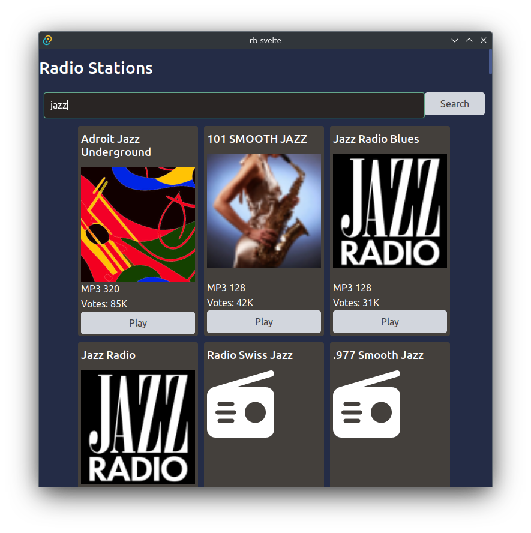
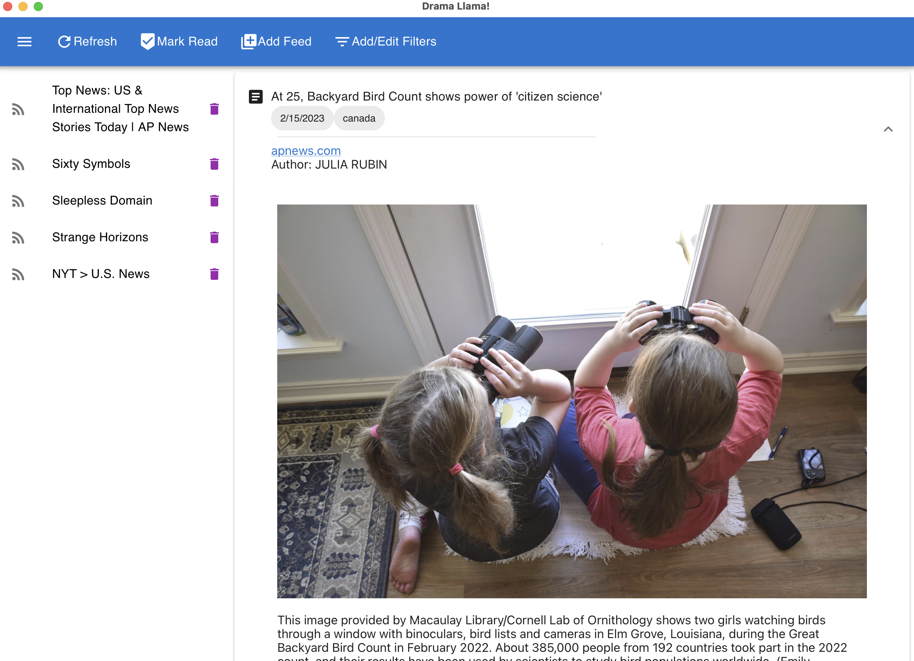

I'm a fullstack developer with edTech experience. I graduated from Ada Developers Academy this year and interned
with Amazon's authentication experience team. In my spare time I experiment with generative music and sew. Looking for work.

If you want a peek into my brain, see my experimental [digital
garden](https://kaesluder.github.io/kae-garden-wiki/).

## Organizations

- [Amazon.com](https://amazon.com/): Developed preference database to improve user authentication experience.
- [Ada Developers Academy](https://adadevelopersacademy.org/): Transition to fullstack software development.
- [Trans Formations Project](https://www.transformationsproject.org): Migration of legislation tracking database to SQL to improve latency and user experience.
- [First City Pride Center](https://www.firstcitypridecenter.org/): Volunteer and resource group organizer.
- [Savannah College of Art and Design](https://www.scad.edu/): Designed 80+ adult elearning courses.

## Selected Projects

### Radio Gaga: [github](https://github.com/kaesluder/radiogaga)

**Technologies:** Rust (Tauri), Typescript, and Svelte

A radiobrowser.info streaming radio client. Play streaming radio stations in many genres from around the world. Desktop app created using Tauri and Svelte.

### Drama Llama: [github](https://github.com/kaesluder/drama-llama-py), [postmortem reflections](https://kaesluder.github.io/kae-garden-wiki/Ada_Capstone_Documentation/Drama_Llama_Postmortem/)

**Technologies:** Python (Flask) and JavaScript (React)

An experimental feed reader delivered as a desktop app and a platform for testing out natural language process filtering strategies.

This was my capstone project for Ada Developers Academy.

### Task List: [front end](https://github.com/kaesluder/task-list-api), [api](https://github.com/kaesluder/task-list-api)

Technologies: Python (Flask) and JavaScript (React)

Demonstration of full-stack task list app. The front end was developed with Erika Sha. (Ada project)

## Other Sites

- <i class="fab fa-github fa-2x"></i> [kaesluder at github](https://github.com/kaesluder)
- <i class="fab fa-linkedin fa-2x"></i> [kae-sluder at LinkedIn](https://www.linkedin.com/in/kae-sluder/)
